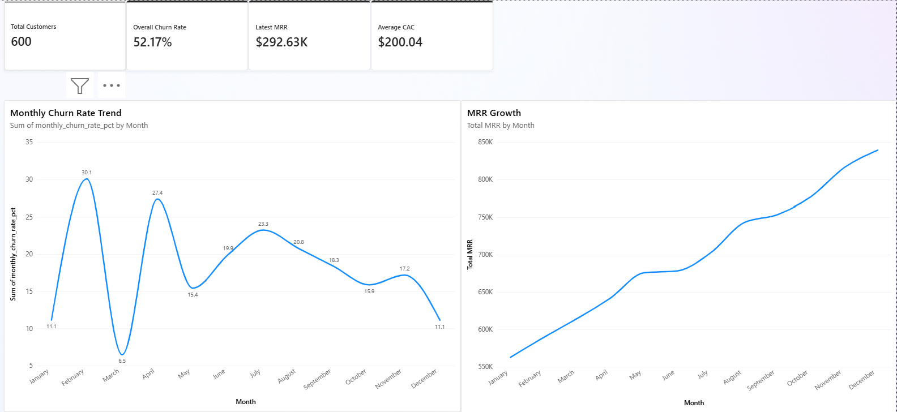
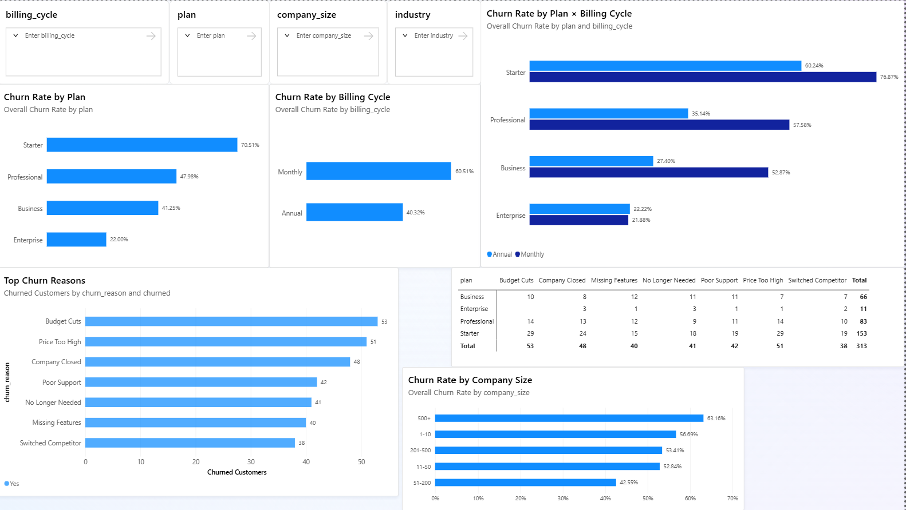
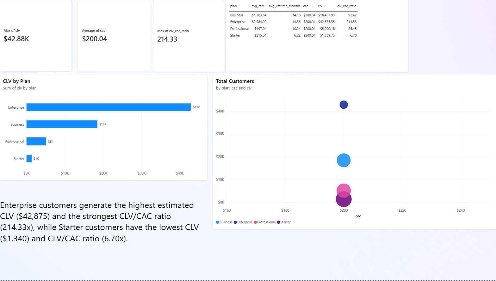

# CloudTask Pro — Revenue & Churn Analysis

## Project Overview

CloudTask Pro is a B2B SaaS company that grew from 0 to 600 customers between 2022 and 2025. Despite revenue growth, management is concerned about high customer churn.

This project analyzes customer subscriptions and monthly revenue data to help the CFO understand:

- How churn has changed over time
- Which customer segments are most at risk
- Whether monthly or annual billing leads to better retention
- Why customers churn
- Customer Lifetime Value (CLV) compared with Customer Acquisition Cost (CAC)
- Which subscription plans have the strongest unit economics

The analysis was completed using **SQL, Excel, and Power BI**.

---

## Business Questions

1. What is the overall churn rate, and how has monthly churn changed over the past four years?
2. Which subscription plan has the highest churn rate? Does billing cycle affect retention?
3. What are the top churn reasons, and do they differ by plan or company size?
4. What is the estimated CLV by plan, how does it compare with CAC, and which plans have the strongest unit economics?

---

## Dashboard

The Power BI dashboard contains three pages:

- **Executive Overview** — overall customer, churn, MRR and CAC metrics, plus monthly trends
- **Churn Analysis** — churn by plan, billing cycle, company size and churn reason
- **Unit Economics** — MRR, customer lifetime, CLV, CAC and CLV/CAC by plan

### Power BI — Executive Overview



### Power BI — Churn Analysis



### Power BI — Unit Economics



> **Power BI file:** `churn_analysis.pbix`

---

# Key Findings

## 1. Overall Churn & Monthly Trend

The overall churn rate is **52.17%**: 313 of 600 customers have churned.

Across the 48-month period, the average monthly churn rate is **4.57%**. Monthly churn increased from **0% in January 2022 to 1.42% in December 2025**, indicating that retention has deteriorated despite customer and revenue growth.

### Business implication

CloudTask Pro is growing its customer base, but customer retention remains a major risk. Continued acquisition without improving retention can make sustainable growth more difficult.

---

## 2. Churn by Subscription Plan

| Plan | Churn Rate |
|---|---:|
| Starter | **70.51%** |
| Professional | 47.98% |
| Business | 41.25% |
| Enterprise | 22.00% |

**Key finding:** Starter customers are the highest-risk segment, with a churn rate more than three times that of Enterprise customers.

This suggests that CloudTask Pro should investigate the Starter customer experience, onboarding process and product-market fit for entry-level customers.

---

## 3. Billing Cycle and Retention

| Billing Cycle | Customers | Churned Customers | Churn Rate |
|---|---:|---:|---:|
| Monthly | 352 | 213 | **60.51%** |
| Annual | 248 | 100 | **40.32%** |

Monthly customers have a churn rate **20.19 percentage points higher** than annual customers.

Annual billing is therefore strongly associated with better retention in this dataset. However, this analysis shows an association rather than proving that annual billing itself causes lower churn.

### Churn by Plan and Billing Cycle

| Plan | Monthly Churn | Annual Churn | Difference (pp) |
|---|---:|---:|---:|
| Business | 52.87% | 27.40% | **25.48** |
| Professional | 57.58% | 35.14% | **22.44** |
| Starter | 76.87% | 60.24% | **16.62** |
| Enterprise | 21.88% | 22.22% | **-0.35** |

Annual billing is associated with lower churn for **Starter, Professional and Business** customers. The largest difference occurs in the Business plan, where annual churn is **25.48 percentage points lower** than monthly churn.

Enterprise customers show virtually no difference between billing cycles.

---

## 4. Churn Reasons

### Overall Top 3 Churn Reasons

| Rank | Churn Reason | Churned Customers |
|---:|---|---:|
| 1 | Budget Cuts | **53** |
| 2 | Price Too High | **51** |
| 3 | Company Closed | **48** |

The top churn reasons suggest that both **customer financial conditions** and **perceived product cost/value** contribute substantially to churn.

### Churn Reasons by Plan

Churn reasons were also segmented by subscription plan to identify differences in customer behavior.

For example, among **Business** customers:

| Churn Reason | % of Business Churn |
|---|---:|
| Missing Features | **18.18%** |
| No Longer Needed | **16.67%** |
| Poor Support | **16.67%** |

This indicates that the reasons for churn are not necessarily the same across customer segments. Product functionality and support appear particularly relevant for Business customers.

The Power BI dashboard provides an interactive view of churn reasons by plan and company size.

---

# 5. Customer Lifetime Value vs. Customer Acquisition Cost

Estimated CLV was calculated as:

**CLV = Average MRR × Average Customer Lifetime**

The average CAC is calculated from the monthly revenue dataset.

| Plan | Avg MRR | Avg Lifetime (months) | Estimated CLV | Avg CAC | CLV/CAC |
|---|---:|---:|---:|---:|---:|
| Enterprise | $2,984.99 | 14.36 | **$42,875.35** | $200.04 | **214.33x** |
| Business | $1,303.64 | 14.18 | **$18,487.93** | $200.04 | **92.42x** |
| Professional | $497.04 | 10.24 | **$5,090.18** | $200.04 | **25.45x** |
| Starter | $215.54 | 6.22 | **$1,339.75** | $200.04 | **6.70x** |

### Key finding

Enterprise customers generate the highest estimated CLV at **$42,875.35** and have the strongest CLV/CAC ratio at **214.33x**.

Business customers are the second strongest segment with an estimated CLV of **$18,487.93** and a **92.42x** CLV/CAC ratio.

Starter customers have the weakest unit economics, with an estimated CLV of **$1,339.75** and a **6.70x** CLV/CAC ratio.

> **Important limitation:** CAC is available as a company-level average rather than plan-specific acquisition cost. Therefore, the CLV/CAC ratios should be interpreted as indicative unit-economics benchmarks rather than exact plan-level profitability measures.

---

# Recommendations

### 1. Prioritize Starter retention

Starter has the highest churn rate at **70.51%** and the lowest CLV/CAC ratio.

Investigate onboarding, product adoption and whether the Starter offering delivers enough value to retain customers.

### 2. Encourage annual billing

Annual customers have substantially lower churn than monthly customers (**40.32% vs. 60.51%**).

CloudTask Pro could test incentives for customers to move from monthly to annual contracts, while monitoring whether the lower churn is sustained.

### 3. Investigate product and support issues

Business customers frequently cite **Missing Features** and **Poor Support** among their churn reasons.

Product feedback and customer-support data should be analyzed further to identify specific features or service issues driving cancellations.

### 4. Protect high-value customers

Enterprise customers have the highest CLV by a large margin.

Even though Enterprise has the lowest overall churn rate, retaining these customers is strategically important because each lost customer represents substantially more potential lifetime revenue.

---
# Dataset

The project uses two datasets:

- **Subscription-level dataset** — customer details, plan, billing cycle, MRR, signup/churn information and churn reasons
- **Monthly revenue dataset** — monthly active customers, new customers, churned customers, MRR, average revenue per customer and CAC

---

# Tools

| Tool | Purpose |
|---|---|
| **MySQL** | Data analysis and business calculations |
| **Excel** | Validation, PivotTables and exploratory analysis |
| **Power BI** | Interactive dashboard and visualization |

---

# Project Structure

```text
CloudTask-Pro-Revenue-Churn-Analysis/
│
├── README.md
├── subscriptions.csv
├── monthly_revenue.csv
├── churn_analysis.pbix
├── SQL/
│   └── churn_analysis.sql
└── images/
    ├── powerbi_executive_overview.png
    ├── powerbi_churn_analysis.png
    └── powerbi_unit_economics.png
```

---

## Conclusion

The analysis shows that CloudTask Pro has a significant retention challenge despite customer and revenue growth.

The highest-risk segment is the **Starter plan**, while **monthly billing** is associated with substantially higher churn than annual billing. At the same time, Enterprise and Business customers generate significantly stronger estimated lifetime value relative to the company's average acquisition cost.

The strongest opportunities are therefore to:

1. Improve retention among Starter customers
2. Encourage annual billing where appropriate
3. Address product and support-related churn drivers
4. Protect high-value Business and Enterprise relationships

These actions could help CloudTask Pro shift from growth driven primarily by acquisition toward more sustainable growth driven by **retention, customer value and stronger unit economics**.
